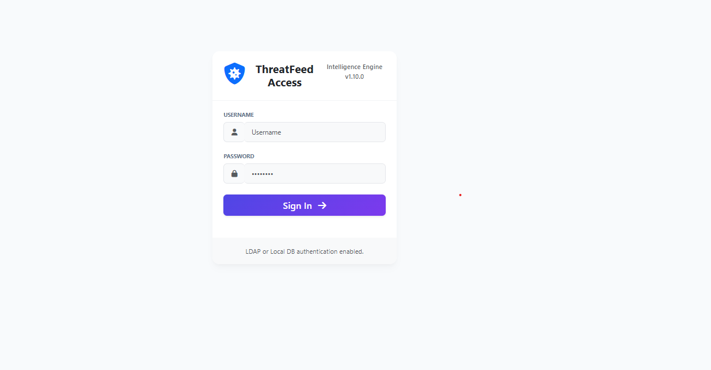

# 🛡️ FORTICAM - FortiManager Interface Controller

**FORTICAM**, FortiManager sistemlerini yönetmek, port durumlarını kontrol etmek ve güvenli erişim sağlamak için geliştirilmiş, kullanıcı dostu bir arayüzdür. Modern tasarımı, rol tabanlı yetkilendirme sistemi ve loglama özellikleri ile ağ yöneticilerinin işini kolaylaştırır.



## 🌟 Özellikler

*   **🛡️ Güvenli Giriş:** Yerel veritabanı ve LDAP (Active Directory) entegrasyonu ile güvenli kimlik doğrulama.
*   **📊 Dashboard:** Yönetilen cihazların ve VDOM'ların anlık durumunu görüntüleme.
*   **🔌 Port Yönetimi:** Yetki seviyelerine göre portları açma/kapama (Enable/Disable) imkanı.
*   **👥 Rol Tabanlı Erişim (RBAC):** Kullanıcı rolleri ve granüler yetkilendirme (Global ve Cihaz bazlı port izinleri).
*   **📝 Audit Logs:** Yapılan tüm işlemlerin (Kullanıcı, Tarih, İşlem, Cihaz) kayıt altına alınması ve CSV olarak indirilmesi.
*   **🚀 Docker Desteği:** Konteyner mimarisi ile kolay kurulum ve taşınabilirlik.
*   **⚡ Performans:** Önbellekleme (Caching) mekanizması ile hızlı veri erişimi.
*   **🎨 Modern Arayüz:** Streamlit tabanlı, özelleştirilebilir ve şık kullanıcı arayüzü.

## 🛠️ Kurulum

Bu proje Docker kullanılarak kolayca çalıştırılabilir.

### Gereksinimler

*   Docker Desktop (Windows/Mac/Linux)

### Adım Adım Çalıştırma

1.  **Repoyu Klonlayın:**
    ```bash
    git clone https://github.com/mhmmtctnn/FORTICAM.git
    cd FORTICAM
    ```

2.  **Uygulamayı Başlatın:**
    Windows kullanıcıları için hazır script:
    ```bash
    .
un_app.bat
    ```
    
    Veya manuel olarak Docker Compose ile:
    ```bash
    docker-compose up -d --build
    ```

3.  **Erişim:**
    Tarayıcınızdan `http://localhost:8501` adresine gidin.

## ⚙️ Yapılandırma

Uygulama ayarları `config_service.py` ve arayüz üzerinden yönetilebilir. 

*   **FMG Bağlantısı:** FortiManager IP adresi ve API Token bilgileri arayüzden girilebilir.
*   **LDAP Ayarları:** `Ayarlar` menüsünden Active Directory sunucu bilgileri ve grup eşleştirmeleri yapılabilir.

## 📂 Proje Yapısı

```
FORTICAM/
├── src/                # Kaynak kodlar (Python/Streamlit)
│   ├── app.py          # Ana uygulama dosyası
│   ├── auth_service.py # Kimlik doğrulama servisi
│   ├── ui_components.py# UI bileşenleri
│   └── ...
├── MFA Logo/           # Logo dosyaları
├── MFA Background/     # Arka plan görselleri
├── docker-compose.yml  # Docker servis tanımı
├── Dockerfile          # Docker imaj tanımı
├── run_app.bat         # Windows başlatma scripti
└── requirements.txt    # Python bağımlılıkları
```

## 🤝 Katkıda Bulunma

1.  Bu repoyu forklayın.
2.  Yeni bir feature branch oluşturun (`git checkout -b feature/YeniOzellik`).
3.  Değişikliklerinizi commitleyin (`git commit -m 'Yeni özellik eklendi'`).
4.  Branch'inizi pushlayın (`git push origin feature/YeniOzellik`).
5.  Bir Pull Request oluşturun.

## 📝 Lisans

Bu proje [MIT](LICENSE) lisansı ile lisanslanmıştır.
